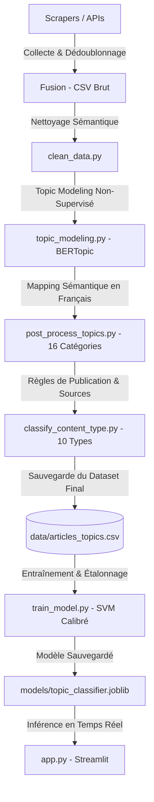

# DiseaseScope 🧬 — Medical Research Intelligence

**Plateforme de veille intelligente, de topic modeling et de classification automatique de la littérature médicale mondiale.**

---

## 📋 Description du Projet

**DiseaseScope** est un outil avancé d'agrégation, d'analyse et de classification automatique de publications scientifiques médicales. La plateforme permet de collecter, normaliser, classifier et visualiser les tendances de la recherche médicale mondiale à partir de sources majeures de données de santé.

### Chiffres Clés du Corpus Actuel
* **30 578 articles** indexés et analysés.
* **5 sources de données majeures** : PubMed, Europe PMC, ClinicalTrials.gov, WHO (OMS), et MedlinePlus.
* **16 macro-catégories médicales** (Oncologie, Cardiologie, Alzheimer & Démence, Maladies Infectieuses, etc.) issues du post-processing de 91 thématiques découvertes par BERTopic.
* **10 types de publication scientifiquement classifiés** (Essai clinique, Méta-analyse, Recherche fondamentale, etc.), résolvant entièrement le problème des données non catégorisées.

---

## 🛠️ Technologies Utilisées

| Domaine | Technologies |
| :--- | :--- |
| **Langage & Cœur** | Python 3.10+ |
| **Collecte de données** | BeautifulSoup, Requests, APIs PubMed (E-utilities) & Europe PMC |
| **Stockage & DVC** | MongoDB (via PyMongo), CSV Local, DVC (Data Version Control) |
| **Traitement & Analyse** | Pandas, NumPy, Scikit-learn, Joblib |
| **Machine Learning & NLP** | BERTopic, TF-IDF, Calibrated LinearSVC (Support Vector Machine avec étalonnage de Platt) |
| **Visualisation & Web** | Streamlit, Plotly Express, CSS3 (Glassmorphic design) |

---

## 🗂️ Architecture du Projet

```
DiseaseScope____Project/
│
├── scrapers/                         # Collecte et fusion des données
│   ├── pubmed_scraper.py             # API PubMed (E-utilities)
│   ├── europepmc_scraper.py          # API Europe PMC
│   ├── who_scraper.py                # Portail WHO (OMS)
│   ├── clinicaltrials_scraper.py     # API ClinicalTrials.gov
│   ├── medlineplus_scraper.py        # MedlinePlus (Encyclopédie médicale)
│   ├── fusionner.py                  # Dédoublonnage et export MongoDB/CSV
│   └── validation_quality.py         # Contrôle qualité post-fusion
│
├── data/                             # Stockage des jeux de données
│   └── articles_topics.csv           # Le dataset final classifié (30k+ articles)
│
├── models/                           # Modèles et métriques sauvegardés
│   ├── topic_classifier.joblib       # Classifieur SVM étalonné (LinearSVC)
│   ├── topic_tfidf.joblib            # Vectoriseur TF-IDF associé
│   ├── topic_label_encoder.joblib    # Encodeur de labels de classes
│   └── topic_metrics.json            # Rapport de performances et accuracy
│
├── src/                              # Code source du pipeline ML & Traitement
│   ├── clean_data.py                 # Nettoyage et normalisation initiale
│   ├── topic_modeling.py             # Stage 1 — Apprentissage non supervisé (BERTopic)
│   ├── post_process_topics.py        # Mappage des 91 topics → 16 macro-catégories
│   ├── classify_content_type.py      # Classification des types de publication par règles regex
│   └── train_model.py                # Stage 2 — Entraînement du classifieur supervisé étalonné
│
├── visualizations/                   # Rapports de visualisation interactifs HTML
│   ├── bertopic_topics.html          # Carte interactive des clusters BERTopic
│   └── bertopic_keywords.html        # Mots-clés discriminants par cluster
│
├── app.py                            # Application Web Streamlit (Dashboard + Recherche + ML)
├── requirements.txt                  # Liste des dépendances Python
└── README.md                         # Documentation de référence
```

---

## ⚙️ Pipeline de Données & ML

Le projet est articulé autour d'un pipeline en 4 grandes étapes :



### 1. Extraction et Fusion des Données
Les scripts du dossier `scrapers/` récupèrent les métadonnées des articles (titre, résumé, source, date, lien). `fusionner.py` unifie les schémas, élimine les doublons par titre et stocke le résultat dans MongoDB et dans un CSV local de secours.

### 2. Post-processing des Topics (91 → 16 Catégories)
L'exécution de BERTopic génère 91 clusters thématiques bruts (ex: `0_alzheimer_ad_cognitive_amyloid`). Le script `post_process_topics.py` mappe ces thématiques vers **16 macro-catégories médicales claires en français** pour alléger les graphiques et améliorer l'expérience utilisateur.

### 3. Classification du Type de Contenu (type_contenu)
Le script `classify_content_type.py` analyse de manière déterministe le titre et le résumé de chaque article en utilisant des règles regex ciblées (priorisant les Méta-analyses, Essais cliniques, Études de cas, Recherche fondamentale, etc.) complétées par des valeurs par défaut selon les sources (ex: *ClinicalTrials* $\rightarrow$ *Essai clinique*). Les articles non classifiés sont minimisés au profit de catégories valides.

### 4. Classification Supervisée Étalonnée (Stage 2)
Le script `train_model.py` entraîne un classifieur de type **LinearSVC** (SVM linéaire) précédé d'une vectorisation **TF-IDF** (25 000 features, unigrammes et bigrammes). 
Pour garantir l'affichage de pourcentages de confiance réalistes dans l'interface, le modèle est calibré à l'aide de **`CalibratedClassifierCV`** (étalonnage sigmoïde de Platt).
* **Accuracy de classification** : **77,8%** sur les 90 classes cibles.

---

## 📊 Fonctionnalités du Dashboard Streamlit (`app.py`)

L'interface utilisateur propose 3 onglets principaux :

1. **📊 Dashboard Analytics** : 
   * Indicateurs clés (KPIs) dynamiques.
   * Graphiques interactifs (Plotly) : distribution par catégorie médicale, répartition par source d'information, évolution temporelle des publications.
   * Matrices de corrélation (`Catégorie × Type` et `Catégorie × Source`) pour repérer instantanément les axes de recherche dominants.
2. **🔍 Recherche Scientifique** :
   * Moteur de recherche plein texte sur les titres et résumés.
   * Filtres à facettes (Catégorie, Type de contenu, Source, Plage d'années via un curseur).
   * Pagination optimisée pour un affichage rapide sous forme de cartes d'articles avec codes couleur premium.
3. **🧪 Test Modèle ML (Inférence en direct)** :
   * Saisie libre d'un texte médical (titre + abstract).
   * Prédiction instantanée de la macro-catégorie médicale associée avec affichage de la confiance calibrée en pourcentage.
   * Visualisation du **Top 5 des prédictions les plus probables** sous forme de graphique horizontal coloré.

---

## 🚀 Installation et Lancement

### 1. Configuration de l'environnement

```bash
# Cloner le dépôt
git clone <url_du_projet>
cd DiseaseScope____Project

# Créer et activer l'environnement virtuel
python -m venv .venv
# Sur Windows :
.venv\Scripts\activate
# Sur Mac/Linux :
source .venv/bin/activate

# Installer les dépendances
pip install -r requirements.txt
```

### 2. Exécution de l'Application

Pour lancer le serveur de visualisation local :
```bash
streamlit run app.py
```

### 3. Cycle de Réentraînement et Maintenance

Si vous lancez à nouveau le scraper de données ou `topic_modeling.py`, suivez cet ordre pour mettre à jour la base de données et les modèles :

```bash
# 1. Appliquer le post-processing des topics sur les nouvelles données
python src/post_process_topics.py

# 2. Re-classifier les types de publications
python src/classify_content_type.py

# 3. Réentraîner le modèle de classification supervisé étalonné
python src/train_model.py
```